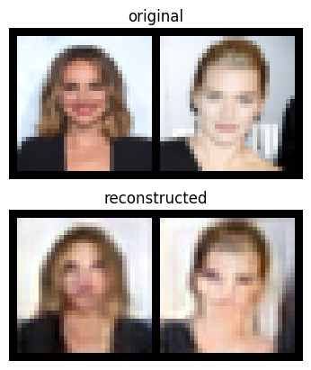
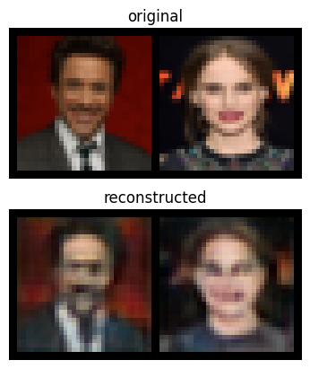
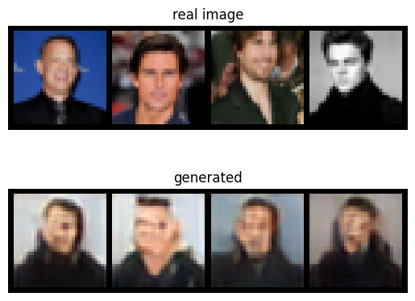
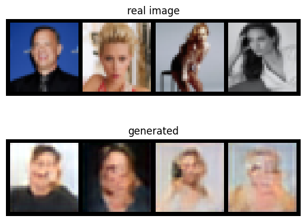

# MaskGIT - Masked Generative Image Transformer
MaskGIT is a two-stage image generation model. The first stage is to quantize an image to a sequence of discrete tokens. In the second stage, an autoregressive model is learned to generate image tokens sequentially based on the previously generated result.
# About this project
- This is a personal project, for educational purposes only!
- This project was built to help understand the 'Vector Quantization' concept and the 'Transformer' architecture.
# Experiment
1. **Training**
   - The first stage (VQGAN):
      - Model size: ~17.9M params (image size: 32, depth: 3, latent dim: 64,...).
      - Dataset: [Celebrity Face Image Dataset](https://www.kaggle.com/datasets/vishesh1412/celebrity-face-image-dataset)
      - Number of epochs: 200.
      - Platform: Google Colab free.
   - The second stage (Transformer):
      - Model size: 35.4M params.
      - Dataset: [Celebrity Face Image Dataset](https://www.kaggle.com/datasets/vishesh1412/celebrity-face-image-dataset)
      - Number of epochs: 400.
      - Platform: Google Colab free.
2. **Results**
   - The reconstructed images are acceptable.
   - The generated images are poor. \
      \
      \
      \
     
3. **Conclusions**
   - The performance is not good. The reasons can be:
      - The dataset is too small (1799 images). ⟶ Try to use a bigger dataset.
      - The model is not large enough. ⟶ Try to use another configuration (increase image_size, depth, laten_dim, d_model, nhead, etc.).
   - The architecture is quite complicated. We need to perform more and more experiments.
# How to use
1. Clone this repo, cd into maskgit.
2. Install the requirements: pip install -q -r requirements.txt.
3. Train the VQGAN: modify the config file (configs/vqgan.yaml), then run the below command:
      ```
       python train.py \
         --phase "vqgan" \
         --config_file "./configs/vqgan.yaml" \
         --max_epochs 10 \
         --ckpt_path "path/to/checkpoint" # when you want to resume training
      ```
4. Train the Transformer: modify the config file (configs/transformer.yaml, in this phase you must provide the vqgan checkpoint), then run the below command:
      ```
       python train.py \
         --phase "transformer" \
         --config_file "./configs/transformer.yaml" \
         --max_epochs 10 \
         --ckpt_path "path/to/checkpoint" # when you want to resume training
      ```
# Based on
  https://arxiv.org/abs/2202.04200 \
  https://arxiv.org/abs/2012.09841 \
  https://github.com/dome272/MaskGIT-pytorch \
  https://github.com/CompVis/taming-transformers \
  https://github.com/google-research/maskgit \
  https://github.com/hmorimitsu/maskgit-torch \
  https://github.com/richzhang/PerceptualSimilarity \
  https://github.com/lucidrains/vector-quantize-pytorch \
  https://huggingface.co/docs/diffusers/api/models/unet2d
